# Tables Specification

### USER
- `user_id`: UUID PK
- `username`: Varchar(50) NOT_NULL
- `email`: Varchar(100) NOT_NULL UNIQUE
- `password_hash`: Varchar(255) NOT_NULL
- `role`: Varchar(30) NOT_NULL
- `status`: Varchar(20) NOT_NULL
- `created_at`: Timestamp
- `updated_at`: Timestamp
- `deleted_at`: Timestamp

### COMMUNITY_CLUSTER
- `cluster_id`: UUID PK
- `name`: Varchar(120) NOT_NULL
- `description`: Text
- `chapter_code`: Varchar(50)
- `created_by`: UUID FK
- `updated_by`: UUID FK
- `created_at`: Timestamp
- `updated_at`: Timestamp
- `deleted_at`: Timestamp

### CLUSTER_MEMBERSHIP
- `cluster_id`: UUID PK, FK
- `user_id`: UUID PK, FK
- `member_role`: Varchar(30)
- `joined_at`: Timestamp

### HEATMAP_STREAK
- `streak_id`: UUID PK
- `user_id`: UUID FK UNIQUE
- `current_streak`: Integer
- `longest_streak`: Integer
- `last_active_date`: Date
- `updated_at`: Timestamp

### REMINDER_NOTIFICATION
- `notification_id`: UUID PK
- `user_id`: UUID FK
- `notification_type`: Varchar(30)
- `channel`: Varchar(30)
- `message`: Text
- `scheduled_at`: Timestamp
- `sent_at`: Timestamp
- `status`: Varchar(20)

### LEARNING_ROADMAP
- `roadmap_id`: UUID PK
- `user_id`: UUID FK (Owner)
- `title`: Varchar(150) NOT_NULL
- `description`: Text NOT_NULL
- `visibility`: Varchar(20) NOT_NULL
- `is_dynamic`: Boolean
- `created_by`: UUID FK
- `updated_by`: UUID FK
- `created_at`: Timestamp
- `updated_at`: Timestamp
- `deleted_at`: Timestamp

### CLUSTER_NODE_MAPPING
- `cluster_id`: UUID PK, FK
- `node_id`: UUID PK, FK
- `added_by`: UUID FK
- `created_at`: Timestamp

### SKILL_NODE
- `node_id`: UUID PK
- `roadmap_id`: UUID FK
- `title`: Varchar(150) NOT_NULL
- `slug`: Varchar(150) NOT_NULL UNIQUE
- `order_index`: Integer NOT_NULL
- `node_type`: Varchar(30) NOT_NULL
- `content_json`: Jsonb
- `is_locked`: Boolean
- `created_by`: UUID FK
- `updated_by`: UUID FK
- `created_at`: Timestamp
- `updated_at`: Timestamp
- `deleted_at`: Timestamp

### NODE_PREREQUISITE
- `parent_node_id`: UUID PK, FK
- `child_node_id`: UUID PK, FK
- `relation_type`: Varchar(50)
- `created_at`: Timestamp

### USER_NODE_PROGRESS
- `progress_id`: UUID PK
- `user_id`: UUID FK
- `node_id`: UUID FK
- `status`: Varchar(30) NOT_NULL
- `unlocked_at`: Timestamp
- `completed_at`: Timestamp
- `last_accessed_at`: Timestamp

### LEARNING_CONTENT
- `content_id`: UUID PK
- `node_id`: UUID FK
- `source_type`: Varchar(30) NOT_NULL
- `source_url`: Text
- `title`: Varchar(200)
- `content_body`: Text
- `meta_json`: Jsonb
- `synced_at`: Timestamp

### CHALLENGE
- `challenge_id`: UUID PK
- `node_id`: UUID FK
- `title`: Varchar(150) NOT_NULL
- `description`: Text
- `difficulty`: Varchar(20)
- `max_score`: Integer
- `is_required`: Boolean
- `created_by`: UUID FK
- `updated_by`: UUID FK
- `created_at`: Timestamp
- `updated_at`: Timestamp
- `deleted_at`: Timestamp

### LEADERBOARD
- `leaderboard_id`: UUID PK
- `niche`: Varchar(50) NOT_NULL
- `period`: Varchar(30)
- `calculated_at`: Timestamp

### LEADERBOARD_ENTRY
- `leaderboard_id`: UUID PK, FK
- `user_id`: UUID PK, FK
- `nodes_passed`: Integer
- `revision_requests_count`: Integer
- `peer_review_contributions`: Integer
- `score`: Integer
- `rank_position`: Integer

### GITHUB_REPOSITORY
- `repo_id`: UUID PK
- `user_id`: UUID FK
- `github_url`: Text
- `repo_name`: Varchar(150)
- `default_branch`: Varchar(100)
- `webhook_secret_encrypted`: Varchar(255)
- `last_synced_at`: Timestamp
- `deleted_at`: Timestamp

### GITHUB_WEBHOOK_EVENT
- `webhook_event_id`: UUID PK
- `repo_id`: UUID FK
- `event_type`: Varchar(50)
- `delivery_id`: Varchar(100)
- `payload_json`: Jsonb
- `received_at`: Timestamp
- `processed_at`: Timestamp

### SUBMISSION
- `submission_id`: UUID PK
- `user_id`: UUID FK
- `challenge_id`: UUID FK
- `github_repo_id`: UUID FK
- `branch_name`: Varchar(100)
- `commit_hash`: Varchar(100)
- `submitted_at`: Timestamp
- `status`: Varchar(30)

### PEER_REVIEW
- `peer_review_id`: UUID PK
- `submission_id`: UUID FK
- `reviewer_user_id`: UUID FK
- `rating`: Integer
- `comment`: Text
- `created_at`: Timestamp

### CODE_REVIEW
- `review_id`: UUID PK
- `submission_id`: UUID FK
- `reviewer_type`: Varchar(30)
- `score`: Integer
- `decision`: Varchar(30)
- `feedback`: Text
- `reviewed_at`: Timestamp

### AI_REVIEW_TASK
- `task_id`: UUID PK
- `webhook_event_id`: UUID FK
- `submission_id`: UUID FK
- `agent_name`: Varchar(50)
- `task_status`: Varchar(30)
- `analysis_json`: Jsonb
- `started_at`: Timestamp
- `completed_at`: Timestamp

### AI_MODEL_CONFIG
- `config_id`: UUID PK
- `model_provider`: Varchar(50)
- `model_name`: Varchar(100)
- `api_key_encrypted`: Varchar(255)
- `enabled`: Boolean
- `updated_at`: Timestamp

### DEPLOYMENT_ENVIRONMENT
- `environment_id`: UUID PK
- `user_id`: UUID FK
- `name`: Varchar(50) NOT_NULL
- `platform`: Varchar(50)
- `container_image`: Varchar(200)
- `host_name`: Varchar(100)
- `url`: Text
- `deleted_at`: Timestamp

### AI_ASSISTANT_CONVERSATION
- `conversation_id`: UUID PK
- `user_id`: UUID FK
- `node_id`: UUID FK
- `session_token`: Varchar(255)
- `context_summary`: Text
- `created_at`: Timestamp
- `updated_at`: Timestamp

# Relationships Specification

### USER
- USER(user_id) 1---n LEADERBOARD_ENTRY(user_id) (ranks)
- USER(user_id) 1---n AI_ASSISTANT_CONVERSATION(user_id) (uses)
- USER(user_id) 1---n SUBMISSION(user_id) (submits)
- USER(user_id) 1---n PEER_REVIEW(reviewer_user_id) (reviews)
- USER(user_id) 1---n CLUSTER_MEMBERSHIP(user_id) (joins)
- USER(user_id) 1---1 HEATMAP_STREAK(user_id) (tracks)
- USER(user_id) 1---n REMINDER_NOTIFICATION(user_id) (receives)
- USER(user_id) 1---n LEARNING_ROADMAP(user_id) (owns)
- USER(user_id) 1---n LEARNING_ROADMAP(created_by/updated_by) (audits)
- USER(user_id) 1---n SKILL_NODE(created_by/updated_by) (audits)
- USER(user_id) 1---n CHALLENGE(created_by/updated_by) (audits)
- USER(user_id) 1---n COMMUNITY_CLUSTER(created_by/updated_by) (audits)
- USER(user_id) 1---n GITHUB_REPOSITORY(user_id) (connects)
- USER(user_id) 1---n DEPLOYMENT_ENVIRONMENT(user_id) (owns)
- USER(user_id) 1---n USER_NODE_PROGRESS(user_id) (tracks progress)
- USER(user_id) 1---n CLUSTER_NODE_MAPPING(added_by) (manages)

### COMMUNITY_CLUSTER
- COMMUNITY_CLUSTER(cluster_id) 1---n CLUSTER_MEMBERSHIP(cluster_id) (groups)
- COMMUNITY_CLUSTER(cluster_id) 1---n CLUSTER_NODE_MAPPING(cluster_id) (contains)

### LEARNING_ROADMAP
- LEARNING_ROADMAP(roadmap_id) 1---n SKILL_NODE(roadmap_id) (contains)

### GITHUB_REPOSITORY
- GITHUB_REPOSITORY(repo_id) 1---n GITHUB_WEBHOOK_EVENT(repo_id) (emits)
- GITHUB_REPOSITORY(repo_id) 1---n SUBMISSION(github_repo_id) (source of)

### LEADERBOARD
- LEADERBOARD(leaderboard_id) 1---n LEADERBOARD_ENTRY(leaderboard_id) (contains)

### SKILL_NODE
- SKILL_NODE(node_id) 1---n NODE_PREREQUISITE(parent_node_id) (prerequisite of)
- SKILL_NODE(node_id) 1---n NODE_PREREQUISITE(child_node_id) (depends on)
- SKILL_NODE(node_id) 1---n LEARNING_CONTENT(node_id) (has)
- SKILL_NODE(node_id) 1---n CHALLENGE(node_id) (generates)
- SKILL_NODE(node_id) 1---n AI_ASSISTANT_CONVERSATION(node_id) (focuses on)
- SKILL_NODE(node_id) 1---n USER_NODE_PROGRESS(node_id) (monitored by)
- SKILL_NODE(node_id) 1---n CLUSTER_NODE_MAPPING(node_id) (belongs to)

### GITHUB_WEBHOOK_EVENT
- GITHUB_WEBHOOK_EVENT(webhook_event_id) 1---n AI_REVIEW_TASK(webhook_event_id) (triggers)

### CHALLENGE
- CHALLENGE(challenge_id) 1---n SUBMISSION(challenge_id) (for)

### SUBMISSION
- SUBMISSION(submission_id) 1---n PEER_REVIEW(submission_id) (receives)
- SUBMISSION(submission_id) 1---n CODE_REVIEW(submission_id) (receives)
- SUBMISSION(submission_id) 1---n AI_REVIEW_TASK(submission_id) (processed by)

### DEPLOYMENT_ENVIRONMENT
- DEPLOYMENT_ENVIRONMENT(environment_id) 1---n AI_MODEL_CONFIG(environment_id) (uses)

### AI_MODEL_CONFIG
- AI_MODEL_CONFIG(config_id) 1---n AI_REVIEW_TASK(config_id) (powers)

### ERD

```mermaid
erDiagram
    %% ================= ENTITIES =================
    USER {
        UUID user_id PK
        Varchar username
        Varchar email
        Varchar role
        Varchar status
    }

    COMMUNITY_CLUSTER {
        UUID cluster_id PK
        Varchar name
        Varchar chapter_code
    }

    CLUSTER_MEMBERSHIP {
        UUID cluster_id PK,FK
        UUID user_id PK,FK
        Varchar member_role
    }

    HEATMAP_STREAK {
        UUID streak_id PK
        UUID user_id FK
        Integer current_streak
        Integer longest_streak
    }

    REMINDER_NOTIFICATION {
        UUID notification_id PK
        UUID user_id FK
        Varchar notification_type
        Varchar status
    }

    LEARNING_ROADMAP {
        UUID roadmap_id PK
        UUID user_id FK "Owner"
        Varchar title
        Boolean is_dynamic
    }

    CLUSTER_NODE_MAPPING {
        UUID cluster_id PK,FK
        UUID node_id PK,FK
    }

    SKILL_NODE {
        UUID node_id PK
        UUID roadmap_id FK
        Varchar title
        Varchar slug
        Integer order_index
        Jsonb content_json
        Boolean is_locked
    }

    NODE_PREREQUISITE {
        UUID parent_node_id PK,FK
        UUID child_node_id PK,FK
        Varchar relation_type
    }

    USER_NODE_PROGRESS {
        UUID progress_id PK
        UUID user_id FK
        UUID node_id FK
        Varchar status
    }

    LEARNING_CONTENT {
        UUID content_id PK
        UUID node_id FK
        Varchar source_type
        Varchar title
    }

    CHALLENGE {
        UUID challenge_id PK
        UUID node_id FK
        Varchar title
        Integer max_score
    }

    LEADERBOARD {
        UUID leaderboard_id PK
        Varchar niche
        Varchar period
    }

    LEADERBOARD_ENTRY {
        UUID leaderboard_id PK,FK
        UUID user_id PK,FK
        Integer score
        Integer rank_position
    }

    GITHUB_REPOSITORY {
        UUID repo_id PK
        UUID user_id FK
        Varchar repo_name
        Varchar github_url
    }

    GITHUB_WEBHOOK_EVENT {
        UUID webhook_event_id PK
        UUID repo_id FK
        Varchar event_type
        Jsonb payload_json
    }

    SUBMISSION {
        UUID submission_id PK
        UUID user_id FK
        UUID challenge_id FK
        UUID github_repo_id FK
        Varchar commit_hash
        Varchar status
    }

    PEER_REVIEW {
        UUID peer_review_id PK
        UUID submission_id FK
        UUID reviewer_user_id FK
        Integer rating
    }

    CODE_REVIEW {
        UUID review_id PK
        UUID submission_id FK
        Varchar reviewer_type
        Integer score
        Varchar decision
    }

    AI_REVIEW_TASK {
        UUID task_id PK
        UUID webhook_event_id FK
        UUID submission_id FK
        Varchar task_status
        Jsonb analysis_json
    }

    AI_MODEL_CONFIG {
        UUID config_id PK
        Varchar model_provider
        Varchar model_name
        Boolean enabled
    }

    DEPLOYMENT_ENVIRONMENT {
        UUID environment_id PK
        UUID user_id FK
        Varchar name
        Varchar platform
    }

    AI_ASSISTANT_CONVERSATION {
        UUID conversation_id PK
        UUID user_id FK
        UUID node_id FK
        Varchar session_token
    }

    %% ================= RELATIONSHIPS =================
    
    %% User Core Relations
    USER ||--|| HEATMAP_STREAK : "tracks"
    USER ||--o{ LEARNING_ROADMAP : "owns"
    USER ||--o{ CLUSTER_MEMBERSHIP : "joins"
    USER ||--o{ USER_NODE_PROGRESS : "tracks_progress"
    USER ||--o{ SUBMISSION : "submits"
    USER ||--o{ PEER_REVIEW : "reviews"
    USER ||--o{ GITHUB_REPOSITORY : "connects"
    USER ||--o{ LEADERBOARD_ENTRY : "ranks"
    USER ||--o{ REMINDER_NOTIFICATION : "receives"
    USER ||--o{ AI_ASSISTANT_CONVERSATION : "uses"
    USER ||--o{ DEPLOYMENT_ENVIRONMENT : "owns"

    %% Roadmap & Nodes
    LEARNING_ROADMAP ||--o{ SKILL_NODE : "contains"
    SKILL_NODE ||--o{ NODE_PREREQUISITE : "is_prerequisite_of"
    SKILL_NODE ||--o{ NODE_PREREQUISITE : "depends_on"
    SKILL_NODE ||--o{ LEARNING_CONTENT : "has_content"
    SKILL_NODE ||--o{ CHALLENGE : "generates_challenge"
    SKILL_NODE ||--o{ USER_NODE_PROGRESS : "monitored_by"
    SKILL_NODE ||--o{ AI_ASSISTANT_CONVERSATION : "focuses_on"

    %% Community & Grouping
    COMMUNITY_CLUSTER ||--o{ CLUSTER_MEMBERSHIP : "has_members"
    COMMUNITY_CLUSTER ||--o{ CLUSTER_NODE_MAPPING : "contains_nodes"
    SKILL_NODE ||--o{ CLUSTER_NODE_MAPPING : "belongs_to_clusters"

    %% Challenges & Submissions
    CHALLENGE ||--o{ SUBMISSION : "for"
    SUBMISSION ||--o{ PEER_REVIEW : "receives_peer"
    SUBMISSION ||--o{ CODE_REVIEW : "receives_system"
    SUBMISSION ||--o{ AI_REVIEW_TASK : "processed_by_AI"

    %% GitHub Integration
    GITHUB_REPOSITORY ||--o{ SUBMISSION : "source_of"
    GITHUB_REPOSITORY ||--o{ GITHUB_WEBHOOK_EVENT : "emits"
    GITHUB_WEBHOOK_EVENT ||--o{ AI_REVIEW_TASK : "triggers"

    %% AI & Environment
    DEPLOYMENT_ENVIRONMENT ||--o{ AI_MODEL_CONFIG : "uses"
    AI_MODEL_CONFIG ||--o{ AI_REVIEW_TASK : "powers"

    %% Leaderboard
    LEADERBOARD ||--o{ LEADERBOARD_ENTRY : "contains"
```

